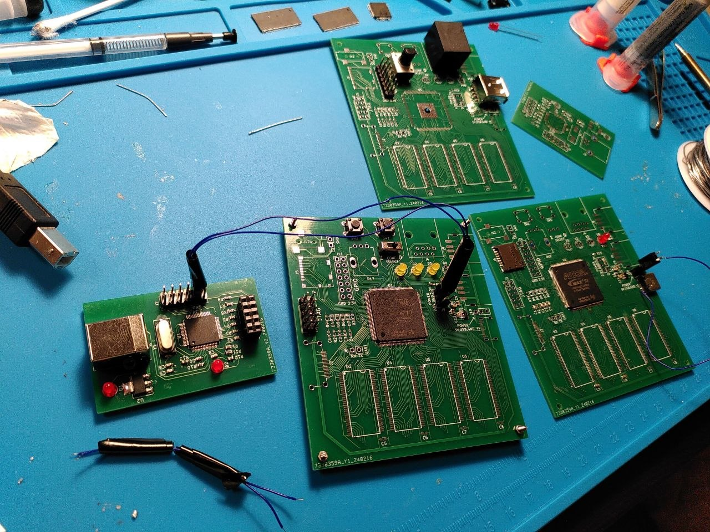
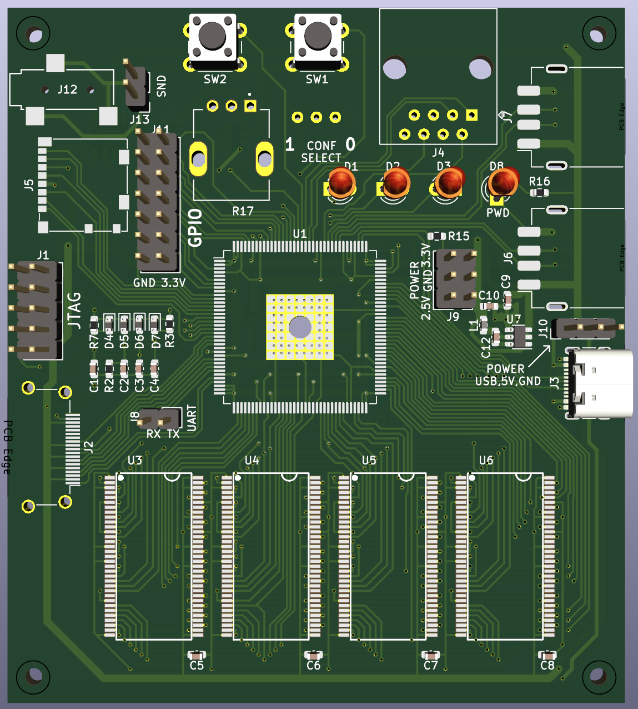
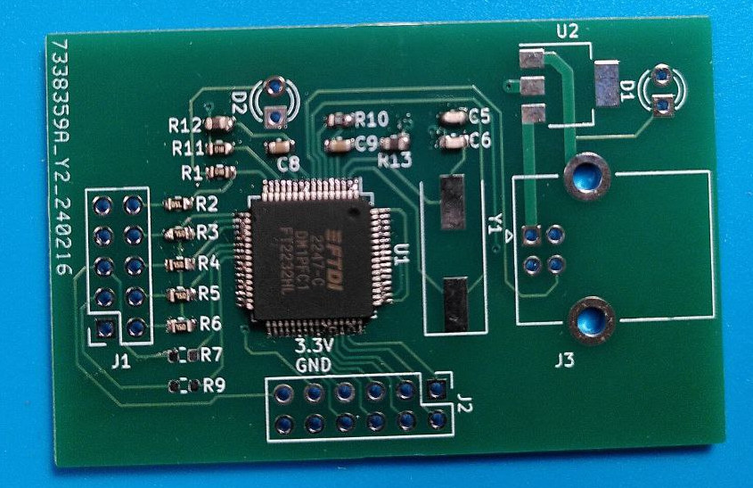
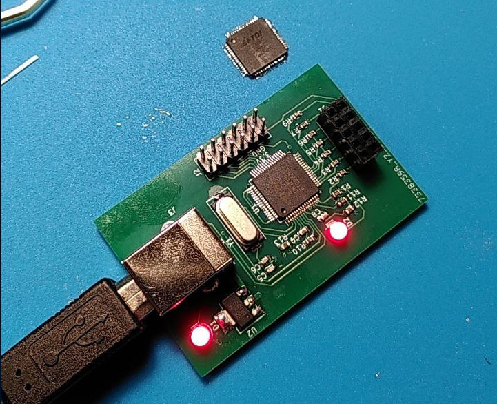
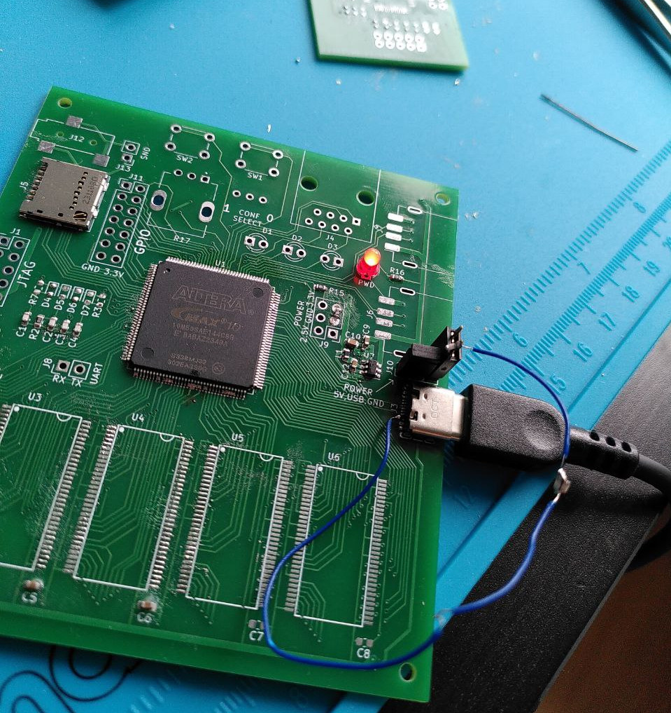
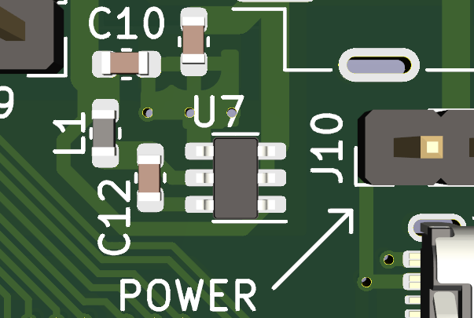
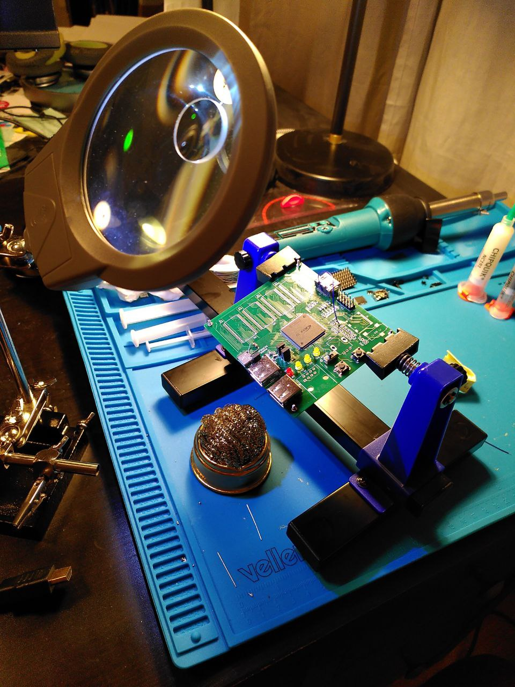
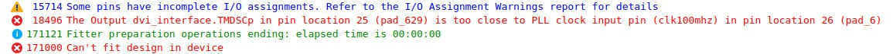

# My DIY FPGA board can run Quake II (part 2)

- Part 1/6: [Introduction](README.md)
- Part 2/6: [First prototype](part2.md) (you are here)
- Part 3/6: [Now it mostly works](part3.md)
- Part 4/6: [Next generation](part4.md)
- Part 5/6: [One more iteration](part5.md)
- Part 6/6: [Optimizing hardware to run Quake II](part6.md)

## Backstory

I was already familiar with FPGAs. About ten years ago, I bought a board with Cyclone IV and tried to write my own processor in Verilog. It had a "unique" architecture that was completely incompatible with anything else on Earth.

But that’s a story for another time. This current journey began two years ago when I remembered that old project. In a sudden burst of nostalgia, I decided to try something in that spirit again.

However, this time I had an idea to build the hardware with my own hands. Not as far as etching the PCBs at home, but I was determined to do the soldering myself.

My previous soldering experience dated back to my school days. The peak of my achievement back then was working with microcontrollers in DIP packages. I remember a failed attempt to build an AVR programmer (which involved a single SOIC chip, if I recall correctly). Looking back, the 60-watt "fire stick" I found in grandfather's toolbox was probably poorly suited for fine electronics work, but for some reason, it never occurred to me to find a better tool back then.

## First attempt

### Planning

First, I had to decide what I can and what I can not do. Unfortunately FPGAs are not available in DIP packages. I decided that soldering a QFP with a 0.5mm lead pitch was a risk I could take.

BGA, however, felt completely beyond the realm of reason (spoiler: a year later, I would eventually cross that line anyway, but at the start of the project, it felt like an impossible goal).

The problem is that almost all "serious" high-performance chips only come in BGA packages. Instead of pins sticking out from the sides, the contacts are tiny balls of solder hidden underneath the chip’s entire bottom surface. If something goes wrong during the soldering process, you can’t even see the mistake, let alone fix it easily.

Avoiding BGA packages narrowed my choices significantly. The largest non-BGA FPGAs I could find were the Altera MAX10 (10M50SAE144 and 10M50SCE144) with 50K logic cells. I settled on the 10M50SAE144C8G and bought two -- I already suspected that I will not succeed from the first attempt.

To reach my goal of "building a computer" I needed RAM, storage, and interfaces for a screen and keyboard.

- Keyboard: I went with USB. While PS/2 is simpler, it is too ancient. I skimmed the USB 1.1 spec and figured I could just wire two data lines to any FPGA pins with 15k resistors to GND. Decided to figure out the protocol details later, once I survive the soldering.
- Video: I saw a similar project using HDMI with same MAX10 FPGA. The author used DDR IO to reach the 742 MHz frequency required for 720p video. Perfect. I noticed their schematic had resistors between the FPGA and the HDMI port, but since that meant more soldering, I decided to skip them and wire the 8 pins directly to the FPGA. (Spoiler: It wasn't that simple, but I'd find that out later).
- Storage: Found a [SD card connection scheme](https://www.fpga4fun.com/SD1.html) on fpga4fun.com. It looked straightforward enough, so I just reserved 6 IO pins for this and continued to other interfaces.
- Memory: Since there is a plan to run Linux, the more RAM the better. The largest non-BGA memory chip I found was 128 MB DDR1 in a TSOP66 package. Then I spent days drowning in datasheets, encountering terms like SSTL2, reference voltage, and termination classes. The meaning of "impedance" at those point remained a mystery to me. Finally I decided to parallel four DDR1 chips on the same address and data lines, using Chip Select to toggle between them. Of course traces on PCB became very long and messy, but I thought if it didn't work at top speed, I'd just lower the frequency. What I didn’t realize then was that DDR1 has also a minimum allowed frequency.

I threw in some LEDs, buttons, an I2C DAC with an amplifier for sound, and an Ethernet port (which I never actually used -- I had enough problems without it).

I heard that for power stability there should be capacitors between VCC and GND, so I added a couple. (Spoiler: I should have researched this topic more. My board would later reboot itself whenever I plugged or unplugged a USB device).

After three weeks of learning KiCad, I finished my first design. I ordered the boards from JLCPCB and was impressed to find that five PCBs, including shipping from China, cost less than a pizza from the place down the street.

*The first prototype, 3d model in KiCad*

Of course, I was hoping for success on the first try. However, I had a feeling that I was attempting too much for my level of experience and that I would encounter every possible problem.

To prevent the undebuggable "it just doesn't work at all" situation, I took a few precautions:

- JTAG programmer was built on a separate PCB based on a known working schematic of [mbftdi](https://github.com/marsohod4you/MBFTDI-SVF-Player). This minimized the risk of a design error and gave me a chance to practice my soldering on a simpler device before touching the main board.
- I bought at least two of every component. As for the PCBs, the minimum order was five anyway.
- The voltage regulators (a 5V to 3.3V switching regulator and a 3.3V to 2.5V linear one) were connected to the rest of the circuit using jumpers. This meant if I botched the soldering and created a short circuit under the FPGA, I could at least isolate and check the power-related part. It also gave me test points for examining with a multimeter.
- I added some LEDs for debug blinking (a must-have for any hardware project!).

## Time to pick up the newly purchased hot air gun and...

Many pins of the FTDI chip are bridged. Apparently I applied too much solder paste. Or maybe the hot air gun was not the right tool for this task. Though I suspect with my skills at this point it wouldn’t be better if I took a soldering iron and tried to precisely touch each pin one by one. Anyway, it's a good thing this was not the main board.

The second try went better. Upon connecting it to the computer, it was recognized as an FTDI device. Success!

This time, the solder bridges appeared on the FPGA. GND and VCC were shorted in multiple places. The FPGA is the most expensive component on the board, and I only had two in stock. Now, I'm down to one. No matter what I tried, I couldn't clear the excess solder. The only thing this board was good for now was testing the power delivery.

Actually, the power didn't work either.

As it turns out, it is required to pull the CC1 and CC2 pins in a USB-C connector to GND through 5.1k resistors. Only then will the power adapter (in this case my laptop’s charger) believe that something is connected and provide 5V to VBUS.

**Expectation:** I spent three weeks designing. It looks like a serious PCB. I'll solder it, and everything will just work.

**Reality:** On day two of troubleshooting, I finally figured out how to get 5V out of a USB-C connector. Yeah!

Right after that, it turned out that U7 (the 3.3V DC-DC converter) was soldered on backward.

  
*U7's top is the longer line, not the "U7" letters.*

The next self-inflicted problem turned out to be the AP2114H 2.5V linear regulator. The full part number I used was **AP2114HA-2.5TRG1**. I assumed that the extra letters at the end were just minor variants that wouldn’t change much. I was wrong. It turns out that the "A" after the "H" stands for "Alternative pinout". I had to place yet another order for components and, on this occasion, for extra soldering tips and a magnifying glass.

My second attempt at soldering the FPGA went much better. At the very least, the power rails weren't shorted to ground. After a full day of meticulously poking each of the 144 pins with a multimeter and a soldering iron back and forth, the chip finally started responding to the programmer via JTAG.

And then -- after fixing yet another floating pin -- I finally managed to make an LED blink.

*Looking at the damaged trace on the PCB after two attempts to solder an HDMI connector.*

The HDMI stage did not go well. While soldering the connector, I managed to bridge a 0.25mm gap between two pins with a tiny blob of solder. In a desperate attempt to fix it, I poked at the bridge with a 400°C iron, only to drive the solder deeper into the connector housing without actually clearing the short.

The situation went from bad to worse when I tried to desolder the connector with a heat gun and ended up lifting a trace.

Eventually, I managed to solder on a spare connector, replaced the ruined trace with a bodge wire, and finally sat down to write the initial Verilog for the video controller.

And then Quartus, the IDE for Altera FPGAs, said this to me:

It turned out that I couldn't just use any random pins for the HDMI output. In hindsight, I should have written a test project and tried to generate FPGA bitstream before designing the PCB layout.

I soldered another wire to a different pin that was intended to be GPIO. Didn't work. The monitor just said "No Signal".

And yeah, it unexpectedly turned out that the JTAG programmer was physically blocking the HDMI port. I couldn't have both plugged in at the same time. This turned the debugging process into a tedious ritual: plug in the programmer, flash the internal memory with a new design, unplug the programmer, plug in the HDMI cable, power it up via USB, and wait to see... "No Signal" again.

For the next prototype, I made a note to keep the video traces short, straight, and isolated from other high-frequency signals.

DDR1 didn't work either. I suspect that looking at my PCB traces a person with relevant experience would instantly say that it couldn't work. And even later on the next prototype tuning IO constraints and debugging memory controller took me months.

However, I finally got a win: SD card reading actually worked! It took a couple of weeks of tinkering, but I successfully integrated the [ZipCPU/sdspi](https://github.com/ZipCPU/sdspi) controller. I just had to migrate the Xilinx-specific frontend to Altera DDR IO primitives.

*The first prototype at its end of life*

## Intermediate results

**What worked:**

- **PCB manufacturing:** Ordering turned out to be easy and convenient.
- Power delivery: Successfully used USB-C for power and converted 5V to the required 3.3V and 2.5V rails.
- **Soldering:** Soldering an EQFP-144 is doable! It wasn't without its problems, but I pulled it off.
- **JTAG programmer:** I can successfully flash the FPGA.
- **Basic I/O:** The LEDs blink, and the buttons respond.
- **Soft-core CPU:** I got first experience with the [VexRiscv](https://github.com/SpinalHDL/VexRiscv) core.
- **UART:** I wrote my own UART controller. I could have searched for an existing one, but I wanted to brush up on my Verilog skills.
- **SD card:** I managed to read data using ZipCPU's controller.

**What didn’t work:**

- **Display connection:** No signal on the HDMI.
- **DDR1 RAM:** A complete failure on this revision.

Audio didn't work right away either, but I didn't spend much time on it -- I was already eager to start the second prototype using everything I'd learned. I also pushed the USB 1.1 implementation to a future phase.

Next part: [Now it mostly works (3/6)](part3.md)
