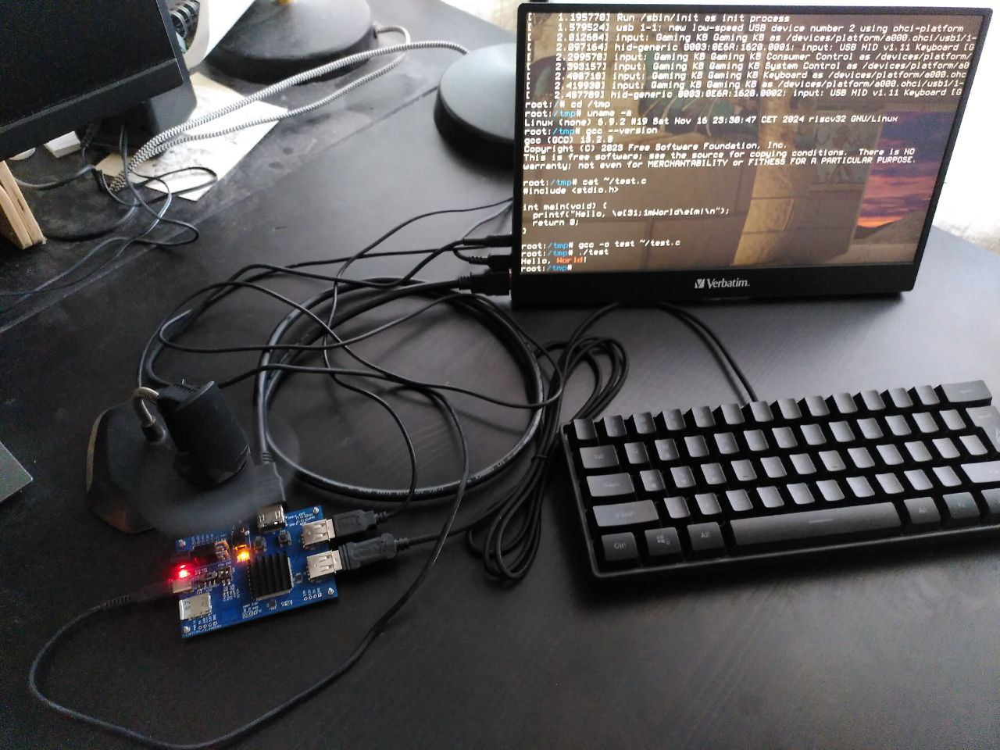
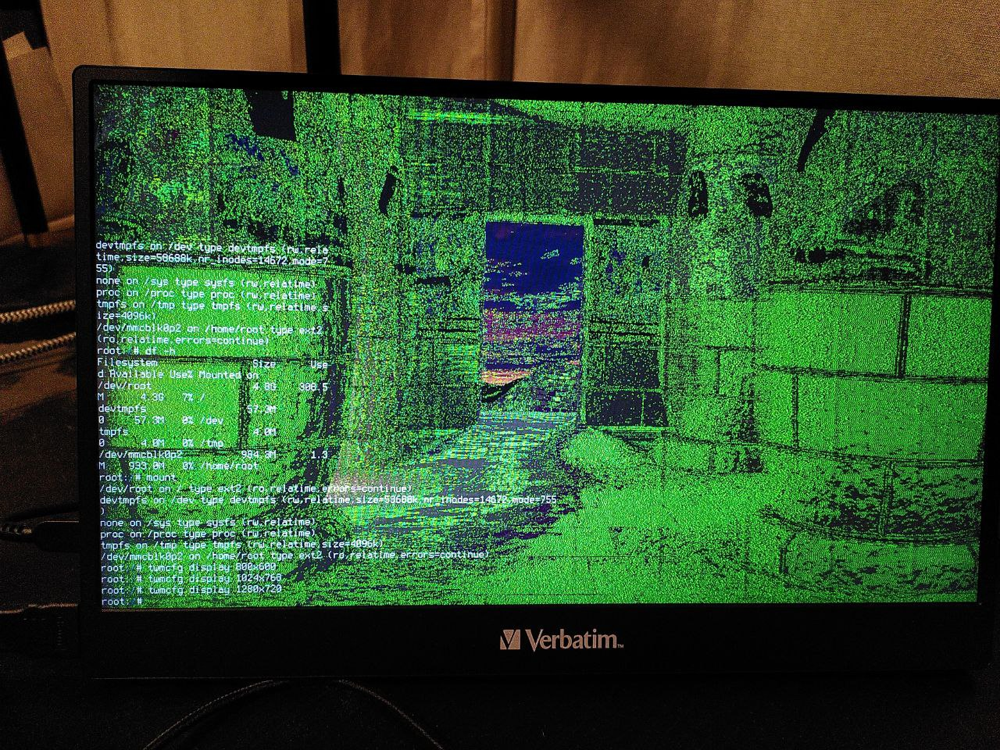

# My DIY FPGA board can run Quake II (part 3)

- Part 1/6: [Introduction](README.md)
- Part 2/6: [First prototype](part2.md)
- Part 3/6: [Now it mostly works](part3.md) (you are here)
- Part 4/6: [Next generation](part4.md)
- Part 5/6: [One more iteration](part5.md)
- Part 6/6: [Optimizing hardware to run Quake II](part6.md)

## Second attempt

Key changes:

- I scaled back to a single RAM chip. With only one, the odds of a successful result were much higher.
- I placed the FPGA and the RAM on opposite sides of the board. This allowed for significantly shorter traces -- a trick I picked up from [WangXuan95](https://github.com/WangXuan95/FPGA-DDR-SDRAM). I also borrowed his DDR1 controller from GitHub (though I eventually ended up rewriting most of it).
- Since the standalone programmer was already proven to work, I integrated it directly onto the main board. Having everything on one PCB is more convenient.
- It turns out the 10M50SAE144 only has a single PLL, which is nowhere near enough. I needed a `pixel_clock` and `bit_clock` for the video interface, 48 MHz for the USB, two 90° phase-shifted clocks for the memory controller, and a CPU clock (the frequency of which was still TBD). To solve this, I added two Si5351A chips -- I2C-programmable clock generators.
- I redesigned the sound output, aiming for 12-bit stereo at up to 44.1 kHz with software-controlled volume.
- I repositioned the HDMI port and double-checked that the selected pins actually supported DDR IO.
- Power button! The first prototype was a bit inconvenient to use without one.

*Top view, 3d model in KiCad*

*Bottom view, 3d model in KiCad*

By this point, I had gained enough experience not to run into any unfixable issues -- though many would say my soldering is still far from perfect.

*Top view*

*Bottom view*

What followed were months of meditating on green lines in gtkwave, repeatedly re-reading the datasheet of the DDR1 chip, and diving into the USB protocol. I spent a significant amount of time trying to figure out why the [OHCI](https://wiki.osdev.org/Open_Host_Controller_Interface) implementation from the [SpinalHDL](https://github.com/SpinalHDL/SpinalHDL) repository wasn't working (it turned out I was incorrectly handling unaligned access in my memory controller). In the later stages the list included adding debug printk statements throughout the Linux kernel.

During this process, I migrated my modules from the AXI4 bus to TileLink and migrated from [VexRiscv](https://github.com/SpinalHDL/VexRiscv/) to the higher-performance [VexiiRiscv](https://github.com/SpinalHDL/VexiiRiscv/).

I spent three months chasing a deadlock that occurred whenever I tried to run gcc on my device. To find it, I had to shrink the entire system down to a 40MB initrd image, create a stripped-down testbench without peripherals, and reproduce the bug in Verilator. Each simulation of the minimal Linux boot took 11 hours. It turned out to be an actual bug in VexiiRiscv; after I sent the trace dump to Dolu1990, he committed a one-line fix within thirty minutes.

I won't go into full detail now, or I'll never finish this article. But in the end, almost everything worked. My single-core CPU, running at 60 MHz, took about ten seconds to compile a simple "Hello World" -- but it was still incredibly cool!

Almost everything worked, with a few notable exceptions:

- **Power instability:** Hotplugging USB keyboard often caused the board to reboot.
- **Video artifacts:** At maximum resolution (which for this board was 1280x720), nasty green artifacts would appear on the screen. I suspect the I/O ports couldn't provide enough drive strength at 742 MHz. Or perhaps it was just due to power rail noise.

*Video artifacts at 1280x720*

The biggest issue was that after six months, the board simply died. Memtest started failing consistently. I suspect the RAM fried because I didn’t pay enough attention to the decoupling capacitors on the power rails. I tried to save it by swapping the RAM chip with the last one I had in stock; the memory started working again, but the heat from the air gun seemingly damaged the FPGA, and the video output stopped working.

Next part: [Next generation (4/6)](part4.md)
