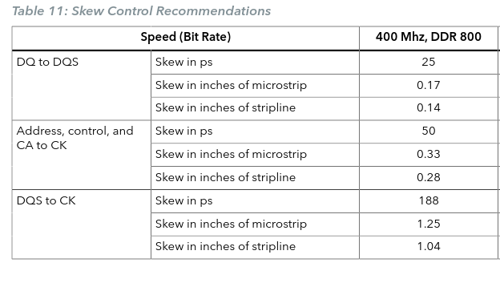
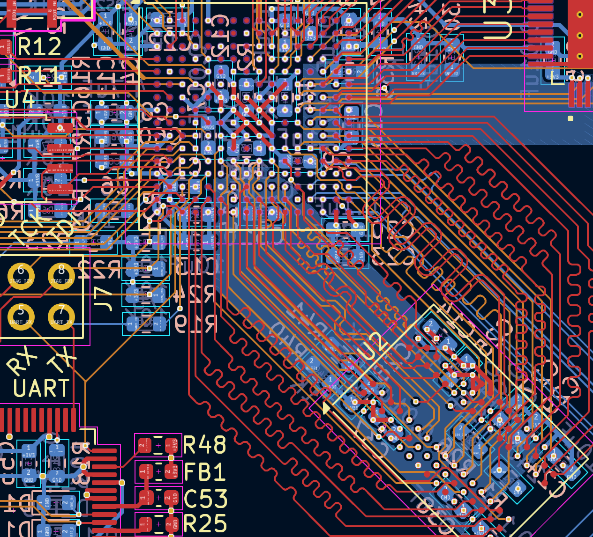
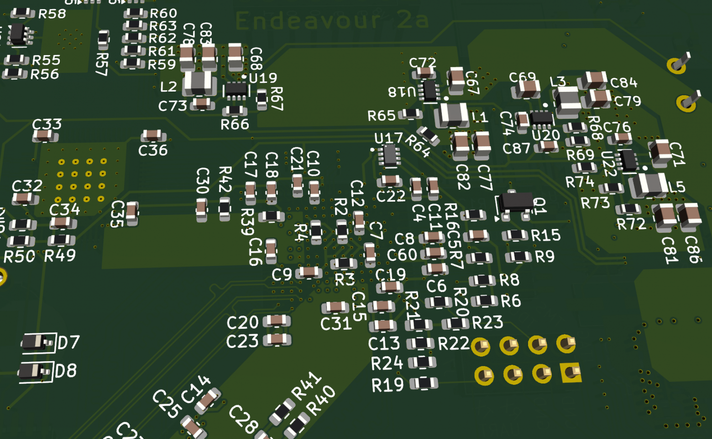
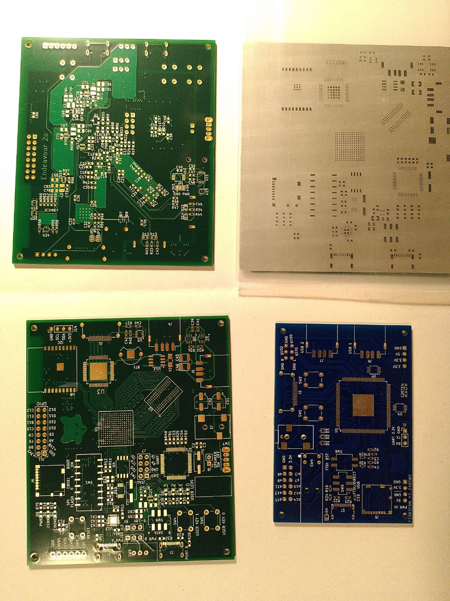
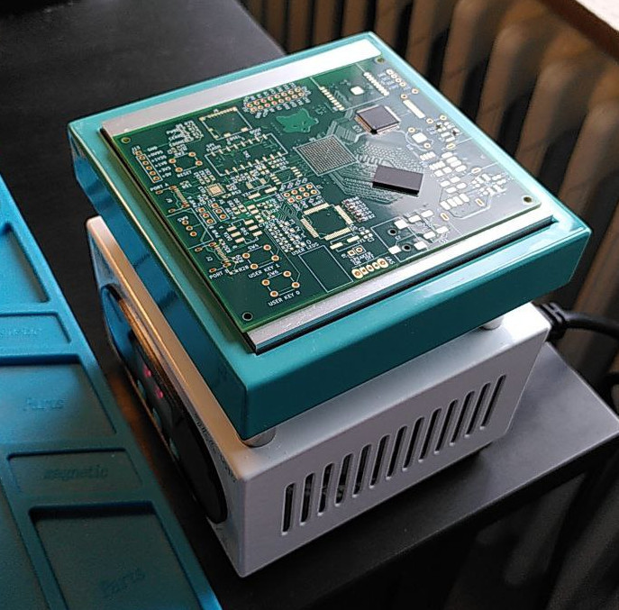
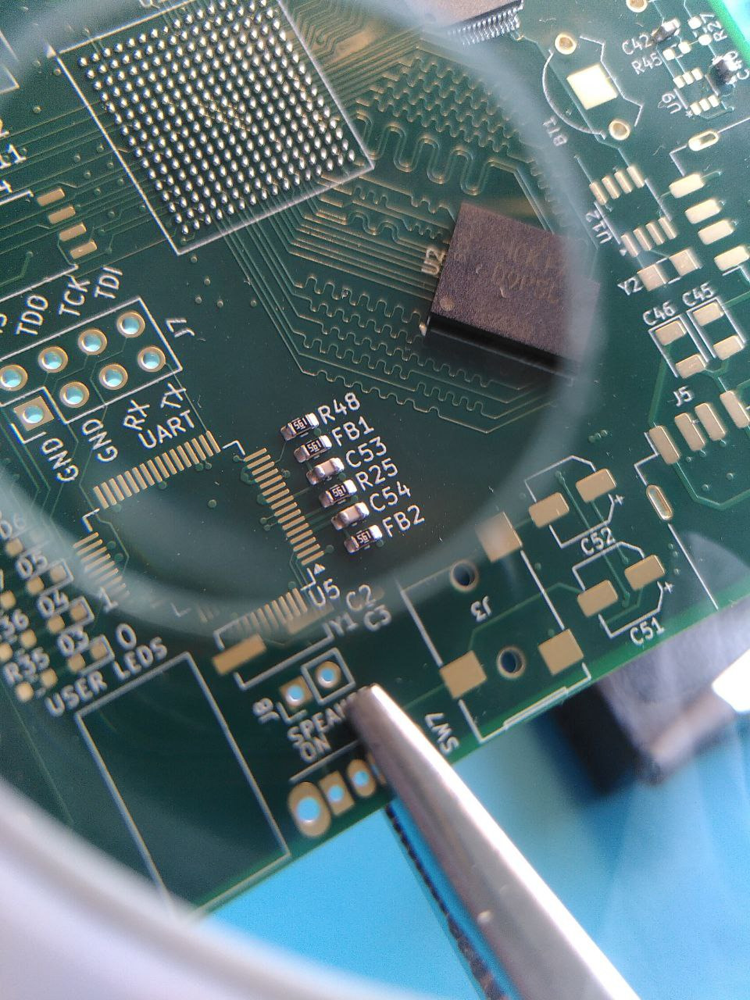

# My DIY FPGA board can run Quake II (part 4)

*22-mar-2026*

- Part 1/6: [Introduction](README.md)
- Part 2/6: [First prototype](part2.md)
- Part 3/6: [Now it mostly works](part3.md)
- Part 4/6: [Next generation](part4.md) (you are here)
- Part 5/6: [One more iteration](part5.md)
- Part 6/6: [Optimizing hardware to run Quake II](part6.md)

## Time to design a new board

I didn't want to simply recreate what I had before. Making something more advanced meant soldering BGA. I wasn't sure if I could do it, but I decided to try anyway.

Specifically, I wanted a more advanced FPGA -- I chose the Efinix Ti60F256 -- and more modern memory -- IM8G16D3FFBG, which is a 1GB DDR3L chip. The first has 256 pins and the second has 96, both with a 0.8 mm pitch.

  
*Some IC in BGA-256 package. Not Ti60 though, but looks very similar.*

After the struggles with DDR1, I had absolutely no desire to reinvent the memory controller. Fortunately, I found something with the promising name "DDR3 Soft Controller Core" on the Efinix website. On their community forum, I was also pointed to a guide on DDR3 PCB layout recommendations.

There were new unfamiliar terms, so I had to spend more time diving into the theory.

  

I barely managed to meet the trace length matching requirements. The recommendations also suggested routing all address and command lines on a single layer, but that seemed impossible. Instead, I tried to account for the difference in signal propagation speeds across different layers and compensated by shortening the traces on the internal layer.

*This time the PCB has 6 layers*

I studied the recommendations for the quantity and values of the decoupling capacitors on the power inputs. However, I still couldn’t follow them strictly; that many components simply wouldn’t fit physically near the power pins, and I really didn’t want to solder anything smaller than 0603 (i.e. 0.06" x 0.03" — 1.6 x 0.8 mm). I just squeezed in as many as I could.

*Capacitors on the back of the board under FPGA, 3d model*

Other changes compared to the previous board:

- A separate TMDS serializer chip (TFP410) to avoid those green artifacts.
- A current limiter for connected USB devices.
- The ability to switch the SD card data line voltage from 3.3V to 1.8V. Potentially, this allows to increase the data transfer speed to 104 MB/s (UHS-1 SDR104 mode).
- A real-time clock and a battery, so that Linux doesn't find itself in 1970 every time it boots.
- An ESP32 module to serve as a WiFi adapter.
- In case the standard 500mA at 5V from USB is insufficient, I added a second USB-C port and a chip capable of requesting a higher voltage from the power supply.

## How to Solder BGA

As it turns out, ordering a six-layer PCB from JLCPCB is significantly more expensive than a two-layer one. This time, the total came to over $100, and the price was nearly the same whether I ordered 5, 10, or 20 copies. For comparison, my previous batch of five two-layer boards cost only $2.

*PCBs and stencil; previous PCB is added for comparison (bottom right)*

Most articles found when searching for "how to solder BGA" are about repairs. Heating with a heat gun, removing a chip from one device, cleaning off the old solder, reballing (placing a solder ball on every pad), and soldering it onto the device being repaired. This is quite difficult and requires specific equipment, but fortunately, it isn't necessary in this case.

Soldering new chips onto new devices is much easier. First, apply solder paste to all the contact pads on the board. Then, place the chips on top and heat them. Note: The solder paste must be rated for the same temperature as the solder balls on the chip's pads. If you're lucky, everything will solder where it should without any bridging where it shouldn't, and you're done. If something goes wrong, which may not be visible, scrap it and start over (or refer to the paragraph above about repairs).

To apply the solder paste neatly, a stencil is needed. My stencil (ordered along with the board) has width exactly matching the size of the PCB. This is quite important, as it makes it easier to align with the board. I used a duct tape to secure the stencil and a plastic card to spread the paste.

I bought a bottom heater with adjustable temperature, listed on the store's website as a "Uyue 946 Constant Temperature Heating Station Screen Removal tool". Before getting down to business, I practiced (I have plenty of spare PCBs) on several cheaper memory chips bought specifically for this purpose. I heated them to 221°C and watched as the solder paste changed color and formed into balls.

*Bottom heater*

I examined the resulting balls on the FPGA footprint. No defects were visible, so I could move on.

*Test run*

With a bottom heater, you can only solder the components on the top side of the board. Then, dozens of capacitors and resistors need to be added to the bottom without damaging anything on top. I decided to solder the bottom side with a heat gun and, just in case, used solder paste with a lower melting point (183°C).

Surprisingly, everything worked on the first try. The first try took three days: soldering the top side, the bottom side, and then the connectors separately. There were no significant issues. In a couple of places adjacent pins bridged (luckily not under the BGA chips), but I managed to separate them.

## System On Chip

To be continued...

TODO
