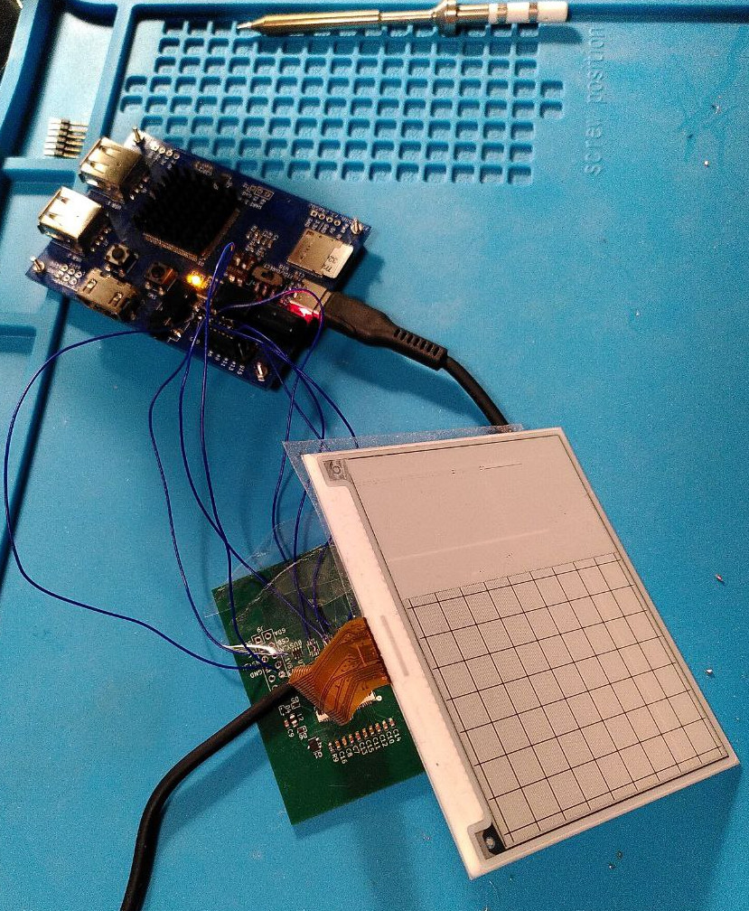
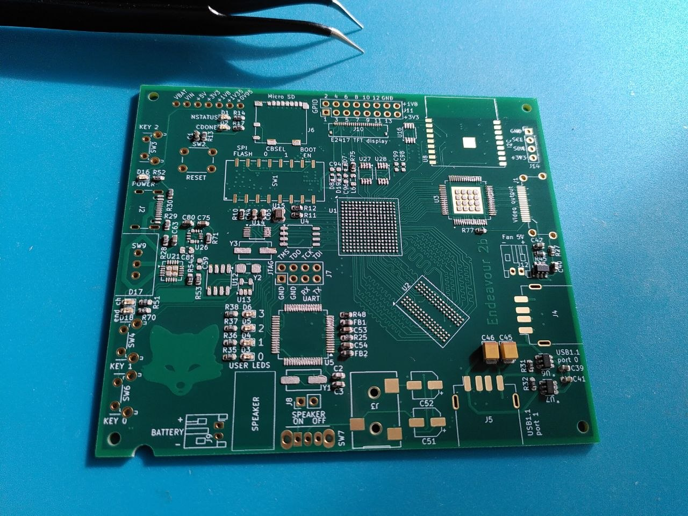
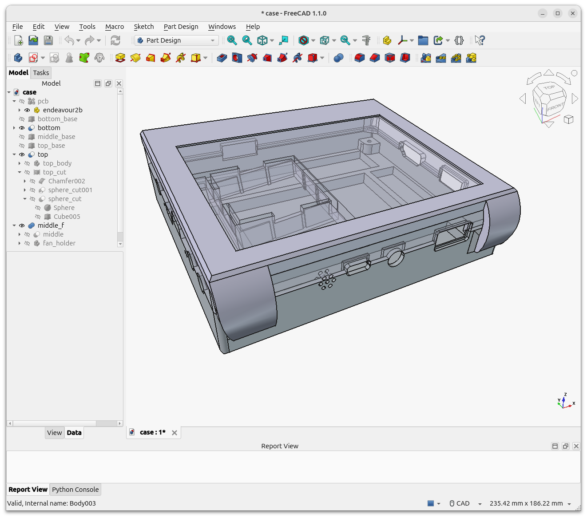

# My DIY FPGA board can run Quake II (part 5)

*29-Mar-2026*

- Part 1/6: [Introduction](README.md)
- Part 2/6: [First prototype](part2.md)
- Part 3/6: [Now it mostly works](part3.md)
- Part 4/6: [Next generation](part4.md)
- Part 5/6: [One more iteration](part5.md) (you are here)
- Part 6/6: [Optimizing hardware to run Quake II](part6.md)

## Wi-Fi adapter

When designing the board I only briefly read about [ESP-Hosted](https://github.com/espressif/esp-hosted).
There were other things to worry about --- BGA soldering, DDR3 routing, and so on. For the first revision Wi-Fi was considered an optional feature --- great if it works, but not a critical problem if it doesn't.
So I just added the ESP32-C3 module and routed the pins required for UART and SPI. UART --- for writing firmware and as a debug interface; SPI -- because ESP-Hosted-NG needs it for Wi-Fi.

Why not connect all the pins just in case? Because the ESP32 I/O ports are 3.3V, and I have already used all of the FPGA's 3.3V-capable pins. Connecting more 1.8V pins would require additional level translators, so I preferred to avoid it.

Later, when I started looking closer, I realized that (a) ESP-Hosted-NG uses different pins for SPI (b) two more pins are needed in the ESP-to-host direction: the Handshake pin and the Data ready pin. In order to compensate it I tweaked the ESP firmware, remapped pins and repurposed UART_RX and SPI_BOOT_EN (which controls whether the ESP boots from UART, or from an internal SPI Flash): when the firmware is started, it stops reading UART (but still logs to UART_TX) and treats UART_RX as SPI Chip Select, and the boot mode pin as a SPI clock.

To run the ESP Host Driver, I had to implement SPI and GPIO drivers for my peripheral controllers. After some struggling with setting up GPIO interrupt routing in Linux kernel, I decided that it would be easier to mimic the hardware interface of some standard GPIO controller, and use an existing driver.

At this point I was already actively using AI to save time on googling. And it striked me back.
The AI lied to me that in **FTGPIO010** the `GPIO_INT_TYPE` register has `0` for level-sensitive interrupts and `1` for edge-sensitive interrupts (actually the opposite).

It cost me a couple of hours of debugging and even more time of trying different placement seeds to fit the project with the fix into the FPGA (when FPGA utilization is 90%, meeting the timing constraints becomes a lottery of choosing the placement seed).

Fortunately I never trusted AI enough to rely on it for hardware design, where the cost of an error is much higher. In the long term reading datasheets on my own can save me more time.

All drivers were ready, but Wi-Fi didn't work. It turned out that remapping pins in ESP firmware led to a 1-bit delay in SPI transfers. I could compensate it on the FPGA side for one-directional transfers, but full-duplex transfers were broken.

Now, at least, I knew which ESP32 pins to connect in the next revision of the board.

## Designing the next revision

The first revision (Endeavour2a) had an unexpected problem. When I showed it to my friends without a technical background, they saw the green PCB and assumed that it was "some computer part".
Apparently, to be considered a standalone device, it should have a case, a screen, and a battery!

I added a 4.2'' E-Ink display (E2417PS0D1) because it fit well to the size of the PCB.

The next revision (Endeavour2b) was supposed to be the final version, so I aimed to avoid any mistakes. I decided to test the new parts on a small 4-layer PCB first. It includes a battery controller, a buck-boost converter, and the display's connection scheme.

I planned to connect the test board to GPIO ports on Endeavour2a, so I added 1.8V to 3.3V level translators.

Something always goes wrong. This time I missed that the SDA pin on the E2417's interface is bidirectional. And that it is essential to read data from the display during initialization. The level translators in the test scheme had a fixed direction.

I decided to solder wires to the level translator inputs, and connect them to Endeavour1 (retired but still partially functioning), which has 3.3V GPIO pins.

Note: It was unwise to use level translators in 8-VSSOP package with 0.5 mm pitch, and not to add any extra test points on the PCB. I am really surprised that I managed to solder these 6 wires.

*E2417PS0D1 shows a test image. The screen was broken during delivery, but I still used it for testing.*

## Soldering

Soldering with a stencil mask and a bottom heater is as simple as picking up components with tweezers and placing them on the PCB. A hundred of components, one by one, very carefully. Take the right one from one of a couple of dozens of plastic bags, and put on the right place on the PCB. Takes hours. And don't sneeze in the middle, or everything will move!

Last time, it took me three days, now I managed to do everything in two.

  
*Endeavour2a (above) and Endeavour2b (below)*

I assembled it, checked that power rails are not shorted to each other, turned it on, and it just worked! I definetely learned something!

## Printing the case

After the first unsuccessful attempt to attach the screen to the upper part of the case with duct tape (actually my first experience with 3D printing), I came up to assembling it of three parts.

The bottom part has a battery pocket and mounting tabs for the PCB.

The display sits on the middle part and is held in place by the top part of the case.

There is also a fan holder in the middle part. Not that the fan was completely necessary, but I added it anyway --- after all this way the device looks a bit more solid.

  

And... It works! The screen resolution is 400x300 pixels. Enough to show some text.

I am considering making a simple e-reader app later.

  

## Internet

Now Wi-Fi works without any problems!

As can be seen in the screenshot, the download speed is 926 KB/s.

  

I tried a few lightweight browsers and settled on [NetSurf](https://www.netsurf-browser.org/). It even has a limited JavaScript support. And no, I can't run Firefox or Chrome here, they are too cumbersome for my device.

  

## Is the hardware part of the project now finished?

Unfortunately, not yet. I discovered a serious design error.

For Endeavour2a, I used the TPS562211 DC-DC converter to generate all the necessary power levels (0.95 V, 1.35 V, 1.8 V, and 3.3 V). The input voltage was 5V from the USB port.

When Endeavour2b operates on battery power, the input voltage can range from 3V to 4.2V. So for the 3.3V rail I switched from the TPS562211 to the MAX77827 buck-boost converter. I tested it in advance on a separate PCB to ensure it would work as expected.

I left the 0.95V, 1.35V, and 1.8V power rails unchanged since this part of the schematic worked well in Endeavour2a. However, I forgot that the TPS562211 requires an input voltage ranging from 4.2V to 18V. Why did I use this one in Endeavour2a? Back then, I wasn't sure how much power it would need, so I added a USB PD chip, which can request an increased voltage from a power adapter. So supporting up to 18V was intentional. But now the  lower limit became a problem.

What does that mean? Endeavour2b can only operate on battery power when the battery is fully charged. If the voltage is below 4V, it just won't turn on.
That's quite upsetting. Later, I will make a new revision, Endeavour2c, to fix this problem.

Next part: [Optimizing hardware to run Quake II (6/6)](part6.md)
