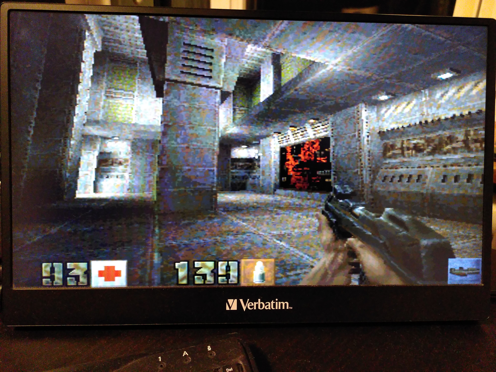
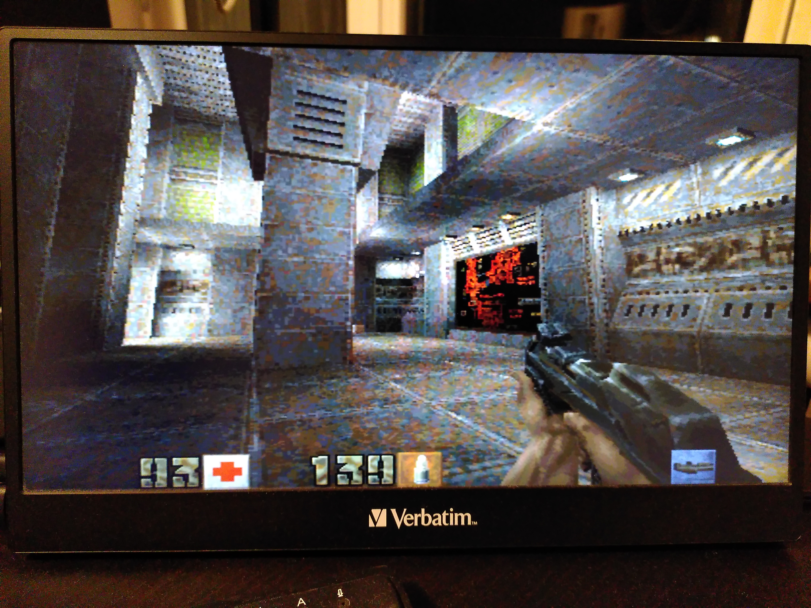
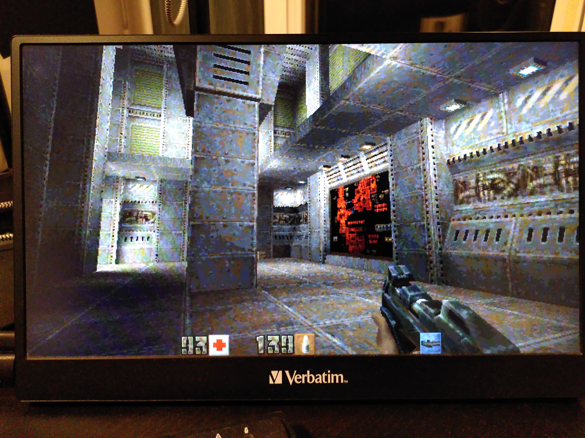
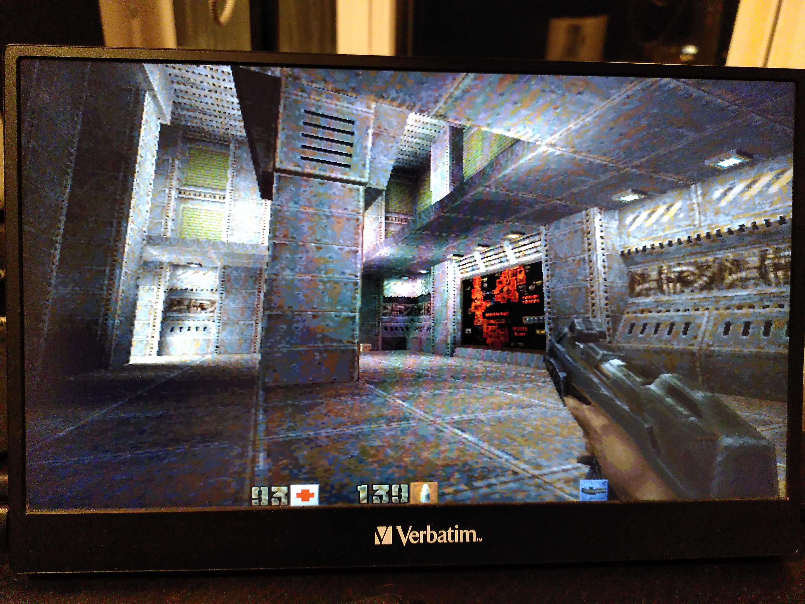
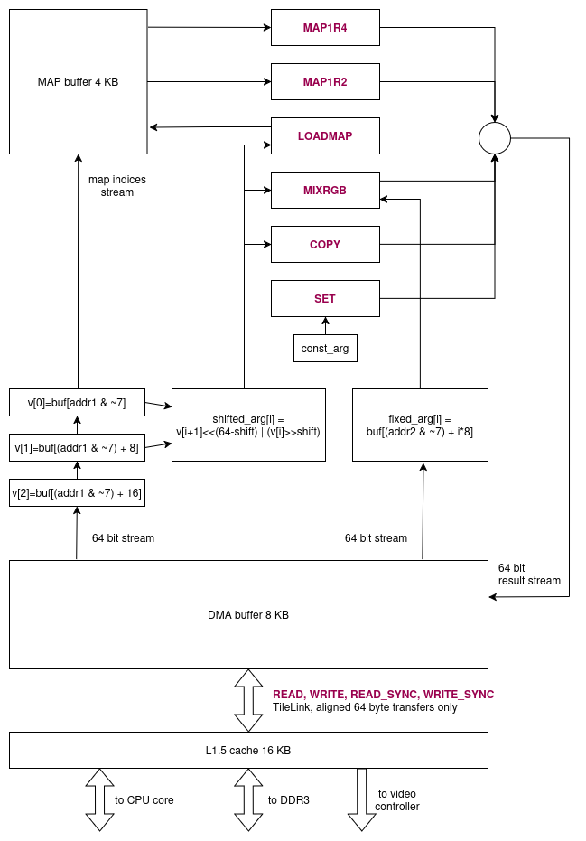

# My DIY FPGA board can run Quake II (part 6)

*30-Mar-2026*

- Part 1/6: [Introduction](README.md)
- Part 2/6: [First prototype](part2.md)
- Part 3/6: [Now it mostly works](part3.md)
- Part 4/6: [Next generation](part4.md)
- Part 5/6: [One more iteration](part5.md)
- Part 6/6: [Optimizing hardware to run Quake II](part6.md) (you are here)

## What is Quake II?

Quake II is a first-person shooter game released in 1997. Considered one of the greatest video games ever made, it is also a programming masterpiece.

> From disk to pixel there are no hidden mechanisms here: Everything has been carefully coded and optimized by hand. It is the last of its kind, marking the end of an era before the industry moved to hardware accelerated only.  
> *(Fabien Sanglard's [Quake2 source code review](https://fabiensanglard.net/quake2/quake2_software_renderer.php))*

## Why it is so impressive that Quake II runs on my FPGA board?

Because in theory the performance shouldn't be enough to render 3D graphics.

I experimented with different rendering resolutions:

| Rendering resolution | Display resolution  | Avg. FPS (demo1.dm2) |
| ------- | ---------------------| ------- |
| 320x240 | 640x480 (2x upscale) | 19.4 |
| 400x300 | 800x600 (2x upscale) | 16.0 |
| 640x360 | 1280x720 (2x upscale) | 12.2 |
| 640x480 | 640x480 (native) | 9.9 |

<details markdown="1">
<summary>Compare screenshots</summary>

    
  *320x240, FPS 19.4*

    
  *400x300, FPS 16.0*

    
  *640x360, FPS 12.2*

    
  *640x480, FPS 9.9*

</details>

640x360 turned out to be the best --- higher FPS than 640x480, and still looks a bit better as it matches my display's aspect ratio.

Let's divide CPU frequency by the average number of pixels it renders every second:  
`207 MHz / (640 * 360 * 12.2) = 73.64`.

So even if we forget about game mechanics and everything else, the CPU has **at most 73 ticks to calculate the color of one pixel**.
Note that it renders a complicated 3D world with textures, dynamic lights, and water surfaces.

I had no idea that 3D rendering can be so crazily optimized. If you are interested in how Quake II does it, I recommend [this](https://fabiensanglard.net/quake2/quake2_software_renderer.php) article by Fabien Sanglard.

Now let's remember that the display doesn't have a 640x360 video mode.
The framebuffer contains 1280x720 pixels in RGB565 format, which is two bytes per pixel.
It is about 1.8 MB per frame. The framebuffer is in system RAM, and the display needs this data 60 times per second (display refresh rate is part of the video mode; not related to the game's FPS). The total RAM throughput is about 1 GB/s, and the video controller alone takes more than 10% of that just to read what was rendered. That's actually why I use 16-bit colors --- to reduce RAM load.

Under these conditions, it's not surprising that any intermediate buffer between the game and the video controller directly affects FPS. Even bilinear upscaling becomes challenging.

## Compilation

The Quake II source code was released under GPL in 2001.
The original code doesn't compile with modern gcc, but there are dozens of forks.

I chose [quake2sdl](https://github.com/shamazmazum/quake2sdl) --- it has all the necessary fixes to build it on Linux, and it is still close to the original source code and simple enough, so it wasn't a problem to find all the SDL usages and adapt them for my hardware (my changes: [quake2sdl.patch](https://github.com/petrmikheev/endeavour2/blob/master/software/buildroot/quake2sdl.patch)).

I edited CMakeLists.txt a bit --- I commented out the OpenGL dependency, which isn't needed for the software renderer,
and I set `CMAKE_C_COMPILER` to the riscv32 cross-compiler and set `CMAKE_FIND_ROOT_PATH` to point to my buildroot location. It compiled successfuly.

## First run

At first, it failed to start with the message "SDL CreateRenderer failed".  
That makes sense. In [src/linux/rw_sdl.c](https://github.com/shamazmazum/quake2sdl/blob/master/src/linux/rw_sdl.c) there is the line

```c
    renderer = SDL_CreateRenderer (window, -1, SDL_RENDERER_ACCELERATED);
```

And I don't have an accelerated renderer.

I changed this call to `SDL_CreateRenderer (window, -1, 0)` and Quake II started!

At a resolution of 320x240 it worked fine in windowed mode (about 7-8 FPS if I recall correctly), but turned into a 0.2 FPS slide show as soon as I tried to switch to fullscreen.
It was SDL2 performing the upscaling from 320x240 to the screen size --- which is normally done by a GPU (that's what `SDL_RENDERER_ACCELERATED` is for).

Things improved when I replaced `SDL_WINDOW_FULLSCREEN_DESKTOP` with `SDL_WINDOW_FULLSCREEN`. This makes SDL switch to the nearest available video mode and upscale to 640x480 rather than 1920x1080.
However, it was still much slower than in windowed mode.

## Tweaking audio driver

I discovered that Quake II runs significantly faster with sound disabled (`+set s_initsound 0` in console arguments). The difference was about 15 ms per frame.
At this point I already had some debug printing in [src/client/cl_main.c](https://github.com/shamazmazum/quake2sdl/blob/master/src/client/cl_main.c), and could see that the lines

```c
    // update audio
    S_Update (cl.refdef.vieworg, cl.v_forward, cl.v_right, cl.v_up);
```

take less than 1 ms per frame.

It means that the rest is spent somewhere inside the ALSA subsystem. Unacceptable! I needed zero overhead.

My audio controller has a hardware FIFO with 1024 samples. The linux driver sets up a timer, and on every kernel jiffy (1/100 of a second in my case) gets samples from `snd_pcm_substream` and sends them to the audio controller. It shouldn't be expensive. It is ALSA doing something in between of the game and [my driver](https://github.com/petrmikheev/endeavour2/blob/master/software/linux/drivers/audio.c).

I modified the driver to bypass ALSA. I added a new audio device `/dev/audio` which allows to mmap a circular audio buffer to user space. It is similar to `/dev/dsp`, but `/dev/dsp` is already emulated by ALSA. I didn't want to interfere with it and created a new one.

The fast path in the driver:

```c
static struct {
  void* buf;
  unsigned size;
  unsigned offset;
} circular = {0, 0, 0};

static void endeavour_audio_timer(struct timer_list *t) {
  mod_timer(t, jiffies);
  if (circular.size > 0) {
    // special mode, used when /dev/audio is memory-mapped to user space.
    int remaining = endeavour_pcm_queue_remaining_size();
    while (remaining-- > 0) {
      endeavour_pcm_add_sample(*(unsigned*)(circular.buf + circular.offset));
      circular.offset += 4;
      if (circular.offset >= circular.size) circular.offset = 0;
    }
    return;
  }
  ...
  // normal mode, get samples from `snd_pcm_substream`
  ...
}
```

Using it in Quake II was as simple as opening the device and calling `mmap`:

```c
    dma.samplebits = 16;
    dma.speed = GetSndFrequency();
    dma.channels = 2;
    dma.samples = 16384;
    dma.samplepos = 0;
    dma.submission_chunk = 1;

    fd = open("/dev/audio", O_RDWR);
    ioctl(fd, 0xaa0, dma.speed);
    dma.buffer = mmap(0, dma.samples * 2,  PROT_READ | PROT_WRITE, MAP_SHARED, fd, 0);
```

The audio overhead disappeared completely.

## Avoiding SDL overhead

The Quake II software renderer uses 8-bit colors internally. The pointer to the buffer it uses is a global variable:

```c
typedef struct
{
    char *buffer;    // the output buffer of the software renderer
    int   rowbytes;  // row pitch; can be > width
    int   width;
    int   height;
    ...
} viddef_t;

extern viddef_t vid;
```

The global variable `sw_state.currentpalette` defines color palette --- the mapping from 8-bit color to RGB24.

Let's see what `quake2sdl` does in [rw_sdl.c](https://github.com/shamazmazum/quake2sdl/blob/master/src/linux/rw_sdl.c) to show `vid.buffer` on the screen.

Initialization (error handling skipped for simplicity):

```c
    window = SDL_CreateWindow ("Quake II",
                               SDL_WINDOWPOS_UNDEFINED, SDL_WINDOWPOS_UNDEFINED,
                               vid.width, vid.height, (fullscreen) ? SDL_WINDOW_FULLSCREEN_DESKTOP : 0);
    renderer = SDL_CreateRenderer (window, -1, SDL_RENDERER_ACCELERATED);
    SDL_SetHint(SDL_HINT_RENDER_SCALE_QUALITY, "linear");
    SDL_RenderSetLogicalSize(renderer, vid.width, vid.height);

    texture = SDL_CreateTexture (renderer, SDL_GetWindowPixelFormat (window),
                                 SDL_TEXTUREACCESS_STREAMING, vid.width, vid.height);

    surface = SDL_CreateRGBSurface (0, vid.width, vid.height, 8, 0, 0, 0, 0);

    vid.rowbytes = surface->pitch;
    vid.buffer = surface->pixels;

    ...

    SDL_SetPaletteColors (surface->format->palette, colors, 0, 256);
```

At the end of each frame:

```c
void SWimp_EndFrame (void) {
    SDL_Surface *tmp = SDL_ConvertSurfaceFormat (surface, SDL_GetWindowPixelFormat (window), 0);
    SDL_RenderClear (renderer);
    SDL_UpdateTexture (texture, NULL, tmp->pixels, tmp->pitch);
    SDL_RenderCopy (renderer, texture, NULL, NULL);
    SDL_RenderPresent (renderer);
    SDL_FreeSurface (tmp);
}
```

The frame was copied at least 4 times!

I changed the initialization to:

```c
    int w_width = vid.width;
    int w_height = vid.height;
    if (fullscreen && w_height < 480) {
        w_width *= 2;
        w_height *= 2;
    }

    window = SDL_CreateWindow ("Quake II",
                               SDL_WINDOWPOS_UNDEFINED, SDL_WINDOWPOS_UNDEFINED,
                               w_width, w_height, (fullscreen ? SDL_WINDOW_FULLSCREEN : 0));

    vid.rowbytes = vid.width;
    vid.buffer = malloc(vid.width * vid.height);
```

Now there is no SDL Renderer at all: I can call `SDL_GetWindowSurface(window)` and write to the window surface directly:

```c
void SWimp_EndFrame (void) {
    SDL_Surface* surface = SDL_GetWindowSurface(window);
    if (surface->format->format != SDL_PIXELFORMAT_RGB565) {
        Sys_Error("(SOFTSDL) pixelformat must be RGB565");
        return;
    }
    SDL_LockSurface(surface);

    uint8_t  *src  = (uint8_t *)vid.buffer;
    uint16_t *dst  = (uint16_t *)surface->pixels;
    unsigned pitch = surface->pitch / sizeof(uint16_t);

    if (surface->w == vid.width && surface->h == vid.height) {
        for (unsigned y = 0; y < vid.height; ++y) {
            for (unsigned x = 0; x < vid.width; ++x) {
                dst[x] = palette[src[x]];
            }
            dst += pitch;
            src += vid.rowbytes;
        }
    } else {
        upscale_2x(src, dst, pitch);
    }

    SDL_UnlockSurface(surface);
    SDL_UpdateWindowSurface(window);
}
```

`upscale_2x` will be explained in the next section.

To avoid copying one more time in the X11 fbdev driver, I turned off ShadowFB in the xorg.conf file:

```
Section "Device"
    Identifier "FBDEV"
    Driver "fbdev"
    Option "fbdev" "/dev/fb0"
    Option "ShadowFB" "off"
EndSection
```

At the next step, I thought, "Why not write the image directly to the video controller's memory and bypass SDL and X11 completely?"

```c
void SWimp_EndFrame (void) {
    SDL_Surface* surface;
    uint8_t  *src  = (uint8_t *)vid.buffer;
    uint16_t *dst;
    unsigned pitch;
    if (!is_fullscreen) {  // In windowed mode we still use SDL and X11.
        surface = SDL_GetWindowSurface(window);
        SDL_LockSurface(surface);
        dst = (uint16_t *)surface->pixels;
        pitch = surface->pitch / sizeof(uint16_t);
    } else {  // In fullscreen mode we write to video memory directly.
              // Since we don't call SDL_UpdateWindowSurface, X11 will
              // assume that it is unchanged and will not touch framebuffer.
        dst = (uint16_t *)video_memory;
        pitch = GRAPHIC_LINE_SIZE / sizeof(uint16_t);
    }
    ...
    if (!is_fullscreen) {
        SDL_UnlockSurface(surface);
        SDL_UpdateWindowSurface(window);
    }
}
```

## Upscaling

How to do the upscaling efficiently?

**Let's start with nearest-neighbor interpolation**

Here is the trick: the palette contains two identical RGB565 values for each entry:

```c
    unsigned palette[256];
    ...
    const char* palette_rgb24 = (const unsigned char*)sw_state.currentpalette;
    for (unsigned i = 0; i < 256; ++i) {
        unsigned r = (palette_rgb24[i*4+0] >> 3) & 0x1F;
        unsigned g = (palette_rgb24[i*4+1] >> 2) & 0x3F;
        unsigned b = (palette_rgb24[i*4+2] >> 3) & 0x1F;
        unsigned rgb = (r << 11) | (g << 5) | b;
        palette[i] = (rgb << 16) | rgb;
    }
```

So we can write two pixels at once:

```c
void upscale_2x_nearest_neighbor(const char* src, unsigned short* dst, unsigned dst_pitch) {
    for (unsigned y = 0; y < vid.height; ++y) {
        unsigned* dst_line1 = (unsigned*) dst;
        unsigned* dst_line2 = (unsigned*)(dst + dst_pitch);
        for (unsigned x = 0; x < vid.width; ++x) {
            dst_line1[x] = dst_line2[x] = palette[src[x]];
        }
        dst += dst_pitch * 2;
        src += vid.rowbytes;
    }
}
```

It requires only 5 riscv-32 instructions per source pixel, assuming the compiler unrolls the loop ([godbolt](https://godbolt.org/z/z7PWcE1TE)):

```
// riscv-32 gcc    -O3 -march=rv32gc_zba -mabi=ilp32d -funroll-loops
        lbu     t1,-7(a4)   // t1 = src[x]
        sh2add  t2,t1,t0    // t2 = (void*)palette + src[x] * 4
        lw      s0,0(t2)    // s0 = palette[src[x]]
        sw      s0,-28(a5)  // dst_line1[x] = s0
        sw      s0,4(t3)    // dst_line2[x] = s0

        lbu     a1,-6(a4)   // same for x+1
        sh2add  t6,a1,t0
        lw      a6,0(t6)
        sw      a6,-24(a5)
        sw      a6,8(t3)

        ...
```

**Bilinear interpolation**

To make the image look slightly better, we need a function calculating an average of two RGB565 values.

It is very easy --- extract each color component and calculate the average:

```c
unsigned short mixrgb(unsigned short a, unsigned short b) {
    int blue  = (( a      & 0x1f) + ( b      & 0x1f)) / 2;
    int green = (((a>>5)  & 0x3f) + ((b>>5)  & 0x3f)) / 2;
    int red   = (((a>>11) & 0x1f) + ((b>>11) & 0x1f)) / 2;
    return (red << 11) | (green << 5) | blue;
}
```

But wait! There are 20 arithmetic operations per call. During the 2x upscaling, we need to call it three times per input pixel.

Remember that the Quake II software renderer uses fewer than 70 CPU clock cycles to render one pixel.
I should mention that I use the VexiiRiscv core with two execution lanes (dual issue), which can evaluate two instructions per tick as long as they are independent of each other and do not access memory.
Therefore, 70 CPU ticks is not exactly 70 assembly instructions, but quite close to it, usually below 100.
Nevertheless, with this implementation bilinear upscaling will be nearly as expensive as the entire Quake II rendering!

Fortunately, there is a more efficient solution:

```c
unsigned mixrgb(unsigned a, unsigned b) {
    unsigned mask = 1 | (1<<5) | (1<<11) | (1<<16) | (1<<21) | (1<<27);
    return (a & b) + (((a ^ b) & ~mask) >> 1);
}
```

It uses only five arithmetic operations. It also mixes two pairs of values simultaneously. So, it is eight times faster than the naive approach.

The algorithm:

```c
static void expand_line(const char* src, unsigned short* dst) {
    unsigned prev = palette[src[0]];
    for (unsigned x = 0; x < vid.width; ++x) {
        unsigned next = palette[src[x]];
        dst[0] = mixrgb(prev, next);
        dst[1] = next;
        dst += 2;
        prev = next;
    }
}

static void mix_line(const unsigned* src1, const unsigned* src2, unsigned* dst) {
    for (unsigned i = 0; i < vid.width; ++i) {
        dst[i] = mixrgb(src1[i], src2[i]);
    }
}

void upscale_2x_bilinear(const char* src, unsigned short* dst, unsigned dst_pitch) {
    expand_line(src, dst);
    for (unsigned y = 1; y < vid.height; ++y) {
        dst += dst_pitch * 2;
        src += vid.rowbytes;
        expand_line(src, dst);
        mix_line((unsigned*)dst, (unsigned*)(dst - dst_pitch * 2), (unsigned*)(dst - dst_pitch));
    }
    expand_line(src, dst + dst_pitch);
}
```

Time for some benchmarking. All results are at 640x360 rendering resolution and 1280x720 display resolution.

| Algorithm | SWimp_EndFrame | Everything else | Avg. FPS (demo1.dm2) |
| ------- | ---------------------| ------- | ---- |
| No upscaling (windowed) | 14 ms | ~85 ms | 10.1 |
| Nearest-neighbor | 15 ms | ~85 ms | 10.0 |
| Bilinear | 27 ms | ~85 ms | 8.9 |

While it is much better than the initial "seconds per frame", the path from `vid.buffer` to the display still takes a measurable fraction of the time budget.

To achieve better results we need to go ~~deeper~~ lower-level and modify the hardware.

## Custom CPU instruction

VexiiRiscv is very flexible and allows to easily add custom instructions.

I just copied the [example](https://spinalhdl.github.io/VexiiRiscv-RTD/master/VexiiRiscv/Execute/custom.html)
and modified it to implement the [MIXRGB](https://github.com/petrmikheev/endeavour2/blob/master/rtl/src/main/scala/endeavour2/CustomInstructions.scala) instruction.

I use two execution lanes, each of which has two ALUs due to the `withLateAlu` option (the second ALU can evaluate an instruction on the next pipeline stage if operands were not yet available for the main ALU).
It means that I needed to create four instances of my custom instructions plugin. The most flexible way to do it was to iterate over all instances of IntAluPlugin, and add instances of the new plugin with the same settings:

```scala
val custom_instrs = ArrayBuffer[Hostable]()
plugins.foreach{
    case p : IntAluPlugin => {
        custom_instrs += new CustomInstructionsPlugin(p.layer, p.aluAt, p.formatAt)
    }
    case _ =>
}
plugins ++= custom_instrs
```

Usage in C:

```c
unsigned mixrgb(unsigned a, unsigned b) {
    // Before: 5 instructions
    // unsigned mask = 1 | (1<<5) | (1<<11) | (1<<16) | (1<<21) | (1<<27);
    // return (a & b) + (((a ^ b) & ~mask) >> 1);

    // After: 1 instruction
    unsigned result;
    asm(".insn r 0x0b, 0, 0, %0, %1, %2" : "=r" (result) : "r" (a), "r" (b));
    return result;
}
```

It saved 10 ms per frame.

| Algorithm |  SWimp_EndFrame | Everything else | Avg. FPS (demo1.dm2) |
| ------- | ---------------------| ------- | ---- |
| No upscaling (windowed) | 14 ms | ~85 ms | 10.1 |
| Nearest-neighbor | 15 ms | ~85 ms | 10.0 |
| Bilinear | 27 ms | ~85 ms | 8.9 |
| Bilinear with MIXRGB | 17 ms | ~85 ms | 9.8 |

## Let's design a ~~GPU~~ DMA controller

Even without upscaling the two memory lookups `palette[src[x]]` take quite some time.

I decided to move this operation from CPU to a custom RTL component ([source code](https://github.com/petrmikheev/endeavour2/blob/master/rtl/src/main/scala/endeavour2/DmaController.scala)).


*DMA controller*

A program running on the CPU prepares a buffer with a series of DMA instructions and sends the starting pointer and the number of instructions to the DMA controller. The DMA controller reads and evaluates the instructions one by one. All instructions work with an internal 8 KB buffer.

Supported instructions:

- **READ**: Starts reading one or more 64 byte blocks from RAM to the DMA buffer; non-blocking, so the next instruction can be processed in parallel.
- **WRITE**: Starts writing one or more 64 byte blocks from the DMA buffer to RAM; non-blocking, so the next instruction can be processed in parallel.
- **READ_SYNC/WRITE_SYNC**: Same as **READ/WRITE**, but waits for the operation to finish.
- **SET**: Functions like `memset` in the DMA buffer.
- **COPY**: Functions like `memcpy` in the DMA buffer.
- **MIXRGB**: Vectorized RGB565 mixing.
- **LOADMAP**: Copies from the DMA buffer to the MAP buffer.
- **MAP1R2**: Vectorized lookup in the MAP buffer. 8-bit index and 16-bit result per lookup.
- **MAP1R4**: Vectorized lookup in the MAP buffer. 8-bit index and 32-bit result per lookup.

Features:

- Low FPGA resource usage: ~2400 logic cells (4%)
- Transfers to/from RAM at 1 GB/s (~3x faster than `memset` on CPU)
- Fast unaligned memset and memcpy.
- Instructions `MAP1R2`, `MAP1R4` can do two palette lookups per clock cycle.
- All operations on the DMA buffer can work in parallel with memory transfers.

**Now all workload from `SWimp_EndFrame` can be offloaded to the DMA controller.**

Because the DMA controller works with physical addresses, we need to place all required data into a reserved memory region with a known physical address.

```c
// Physical address of the reserved memory region
#define PHYS(X) (GRAPHIC_BUFFER(0) + (X))

// Virtual address of the reserved memory region
#define VIRT(X) (video_memory + (X))

// Offsets in the reserved memory region
#define FB_LINE(Y) ((Y) * GRAPHIC_LINE_SIZE)
#define VID1 (GRAPHIC_BUFFER_SIZE * 2)
#define VID2 (VID1 + 1920*1080)
#define PALETTE (VID2 + 1920*1080)
#define DMA_CMD_PALETTE (PALETTE + 1024)
#define DMA_CMD_BUF1 (DMA_CMD_PALETTE + 64)
#define DMA_CMD_BUF2 (DMA_CMD_BUF1 + 16386*8)
```

During the initialization we need to prepare the buffers with DMA instructions.
The macros used below are defined in [include/endeavour2/display.h](https://github.com/petrmikheev/endeavour2/blob/master/software/include/endeavour2/display.h).

```c
static int init_dma_cmd_with_upscale(void* cmd_buf, unsigned SRC) {
#define DST_LINE(Y) PHYS(FB_LINE(Y))
#define SRC_LINE(Y) (SRC + (Y)*vid.rowbytes)
    unsigned ls = vid.width * 4;  // size of one row in the framebuffer in bytes.

    // In the DMA buffer:
    //   buf[0:ls]     - even rows in RGB565 format
    //   buf[ls:ls*2]  - odd rows in RGB565 format
    //   buf[ls*2:ls*2+vid.width]  - next row from vid.buffer (1 byte per pixel)

    // Each macro adds an instruction to `cmd_buf` and increments a counter.
    DMA_PROGRAM_START(cmd_buf)

    // Load first row from `vid.buffer` to the DMA buffer at position ls*2
    DMA_PROGRAM_OP0(        DMA_READ_SYNC,  ls*2, ls*2+vid.rowbytes, SRC_LINE(0))

    // Apply the palette to the row and store the result to buf[0:ls].
    // Each lookup loads 4 bytes. The palette should contain a duplicated
    // RGB565 value for each entry.
    DMA_PROGRAM_OP2(        DMA_MAP1R4,     0, ls, 0, ls*2)

    // Vectorized MIXRGB: buf[2:ls-2] = MIXRGB(buf[2:ls-2], buf[4:ls])
    // The row of pixels is mixed with itself with a 2-byte offset.
    // It is an equivalent of the `expand_line` function in previous snippets.
    DMA_PROGRAM_OP2(        DMA_MIXRGB,     2, ls-2, /*farg=*/2, /*sarg=*/4)

    for (int y = 0; y < vid.height - 1; ++y) {
        DMA_PROGRAM_OP0(    DMA_READ,    ls*2, ls*2+vid.rowbytes, SRC_LINE(y+1))
        if (y&1) {
            DMA_PROGRAM_OP0(DMA_WRITE,     ls, ls*2  , DST_LINE(y*2))
            // This MAP1R4 works in parallel with the previous WRITE.
            DMA_PROGRAM_OP2(DMA_MAP1R4,     0, ls, 0, ls*2)
            // An equivalent of `expand_line` for row `y+1`
            DMA_PROGRAM_OP2(DMA_MIXRGB,     2, ls-2  , /*farg=*/2, /*sarg=*/4)
            // An equivalent of `mix_line` for rows `y` and `y+1`
            DMA_PROGRAM_OP2(DMA_MIXRGB,    ls, ls*2  , /*farg=*/0, /*sarg=*/ls)
            DMA_PROGRAM_OP0(DMA_WRITE,     ls, ls*2  , DST_LINE(y*2+1))
        } else {
            DMA_PROGRAM_OP0(DMA_WRITE,      0, ls    , DST_LINE(y*2))
            DMA_PROGRAM_OP2(DMA_MAP1R4,    ls, ls*2, 0, ls*2)
            DMA_PROGRAM_OP2(DMA_MIXRGB,  ls+2, ls*2-2, /*farg=*/ls+2, /*sarg=*/ls+4)
            DMA_PROGRAM_OP2(DMA_MIXRGB,     0, ls    , /*farg=*/0,    /*sarg=*/ls)
            DMA_PROGRAM_OP0(DMA_WRITE,      0, ls    , DST_LINE(y*2+1))
        }
    }
    DMA_PROGRAM_OP0(DMA_WRITE,              0, ls    , DST_LINE(vid.height*2 - 2))
    DMA_PROGRAM_OP0(DMA_WRITE,              0, ls    , DST_LINE(vid.height*2 - 1))
    int cmd_count;
    DMA_PROGRAM_END(cmd_count)
#undef SRC_LINE
#undef DST_LINE
    return cmd_count;
}

static int init_dma_cmd_load_palette() {
    DMA_PROGRAM_START(VIRT(DMA_CMD_PALETTE))
    DMA_PROGRAM_OP0(DMA_READ_SYNC, 0, 1024, PHYS(PALETTE))
    DMA_PROGRAM_OP1(DMA_LOADMAP,   0, 1024, 0)
    int cmd_count;
    DMA_PROGRAM_END(cmd_count)
    return cmd_count;
}
```

Since it will be used in parallel with the next frame rendering, double buffering is needed:
`vid.buffer` will point either to VID1 or to VID2. Creating a separate instructions buffer for each VID buffer. The number of instructions is the same in both cases, so we store it only once.

```c
dma_cmd_count  = init_dma_cmd_with_upscale(VIRT(DMA_CMD_BUF1), PHYS(VID1));
/* same value */ init_dma_cmd_with_upscale(VIRT(DMA_CMD_BUF2), PHYS(VID2));
load_pallete_cmd_count = init_dma_cmd_load_palette();
```

In `SWimp_EndFrame`:

```c
// Reload the palette and wait for the operation to finish.
display_dma(e2fd, PHYS(DMA_CMD_PALETTE), load_pallete_cmd_count, /*sync=*/1);
if (vid.buffer == VIRT(VID1)) {
    // Start processing frame VID1 and writing the upscaled frame to the frame buffer.
    display_dma(e2fd, PHYS(DMA_CMD_BUF1), dma_cmd_count, /*sync=*/0);
    // Switch vid.buffer to VID2, so Quake can start rendering the next frame without
    // waiting for DMA controller to finish the upscaling operation.
    vid.buffer = VIRT(VID2);
} else {
    display_dma(e2fd, PHYS(DMA_CMD_BUF2), dma_cmd_count, /*sync=*/0);
    vid.buffer = VIRT(VID1);
}
```

| Algorithm |  SWimp_EndFrame | Everything else | Avg. FPS (demo1.dm2) |
| ------- | ---------------------| ------- | ---- |
| No upscaling (windowed) | 14 ms | ~85 ms | 10.1 |
| Nearest-neighbor | 15 ms | ~85 ms | 10.0 |
| Bilinear | 27 ms | ~85 ms | 8.9 |
| Bilinear with MIXRGB | 17 ms | ~85 ms | 9.8 |
| Bilinear with DMA | 0 ms | ~85 ms | 11.7 |

## What about the Quake II software renderer itself?

It is already so well optimized, that I couldn't do much.

The only improvement I managed was increasing the FPS from 11.7 to 12.2 by relaxing memory constraints --- increasing constants `NUMSTACKEDGES`, `NUMSTACKSURFACES`, `MAXSPANS`, `SURFCACHE_SIZE_AT_320X240` in `r_local.h`.

I identified this code in `D_DrawSpans16` as one of the most performance critical. The snippet has been shortened slightly; see the full code [here]((https://github.com/shamazmazum/quake2sdl/blob/master/src/ref_soft/r_scan.c#L387)).

```c
do {
    spancount = min(count, 8);
    count -= spancount;

    if (count) {
        sdivz += sdivz8stepu;
        tdivz += tdivz8stepu;
        zi += zi8stepu;
        z = (float)0x10000 / zi; // A single float division per 8 pixels.
                                 // No way to do perspective correction without it.
        snext = (int)(sdivz * z) + sadjust;
        tnext = (int)(tdivz * z) + tadjust;
        snext = max(min(snext, bbextents), 8);
        tnext = max(min(tnext, bbextentt), 8);

        sstep = (snext - s) >> 3;
        tstep = (tnext - t) >> 3;
    }
    else { ... }

    do { // In the inner loop there are only
         // int32 additions (actually it is 16.16 fixed point),
         // two binary shifts, and an array access.
        *pdest++ = *(pbase + (s >> 16) + (t >> 16) * cachewidth);
        s += sstep;
        t += tstep;
    } while (--spancount > 0);

    s = snext;
    t = tnext;

} while (count > 0);
```

Modern `gcc` optimized it well. I looked to the produced assembly, but there were nothing I could improve.

I tried using the MIN and MAX hardware instructions (I didn't have enough FPGA resources for the full Zbb extension, so added only MIN and MAX). However, this didn't affect performance. I suppose this is because they are not in the inner loop, and because VexiiRiscv's branch prediction is good.

**The current result is 12.2 FPS at 640x360 with bilinear upscaling to 1280x720.**

## That's all for now

Let me show this video again:

<div style="text-align:center;">
  <embed
    src="https://www.youtube-nocookie.com/embed/sioLAkNQC_I"
    width="800"
    height="450"
    type="text/html" />
</div>
